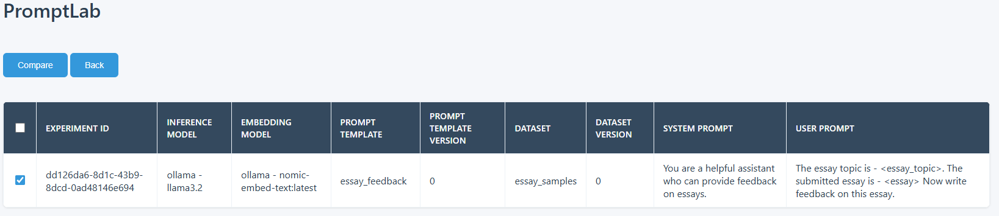

<div align="center">
  
  <h1>🧠 PromptLab</h1>
  <p><strong>Ein kostenloses, leichtgewichtiges, quelloffenes Experimentier-Tool für Gen-AI-Anwendungen</strong></p>
  <p>
    <a href="https://pypi.org/project/promptlab/"></a>
    <a href="https://github.com/imum-ai/promptlab/blob/main/LICENSE"></a>
    <a href="https://github.com/imum-ai/promptlab/stargazers"></a>
  </p>
</div>

---

## 📋 Inhaltsverzeichnis

- [Überblick](#überblick-)
- [Funktionen](#funktionen-)
- [Installation](#installation-)
- [Schnellstart](#schnellstart-)
- [Kernkonzepte](#kernkonzepte-)
- [Dokumentation](#dokumentation-)
- [Unterstützte Modelle](#unterstützte-modelle-)
- [Beispiele](#beispiele-)
- [Artikel & Tutorials](#artikel--tutorials-)
- [Beitragen](#beitragen-)
- [Lizenz](#lizenz-)

---

## Überblick 🔍

**PromptLab** ist ein kostenloses, leichtgewichtiges und quelloffenes Experimentier-Tool für Gen-AI-Anwendungen.  
Es vereinfacht das Prompt-Engineering, indem es die Einrichtung von Experimenten, die Auswertung von Prompts und das Tracking in der Produktion erleichtert – **ohne Cloud-Dienste oder komplexe Infrastruktur**.

### Mit PromptLab kannst du:

✅ Prompt-Vorlagen mit Versionsverwaltung erstellen und verwalten  
✅ Evaluations-Datensätze aufbauen und pflegen  
✅ Experimente mit verschiedenen Modellen und Prompts durchführen  
✅ Modell- und Prompt-Leistung anhand integrierter oder benutzerdefinierter Metriken bewerten  
✅ Ergebnisse von Experimenten nebeneinander vergleichen  
✅ Optimierte Prompts direkt in die Produktion überführen  

<div align="center">
  
  <p><em>PromptLab Studio – intuitive Weboberfläche zur Analyse und zum Vergleich von Experimenten</em></p>
</div>

---

## Funktionen ✨

| Kategorie | Beschreibung |
|------------|---------------|
| 🪶 **Leichtgewichtig** | Kein Cloud-Abo, keine zusätzlichen Server, kein Docker – nur ein Python-Paket |
| 🧩 **Einfach zu verwenden** | Keine ML- oder Data-Science-Kenntnisse erforderlich |
| 🔒 **Eigenständig** | Vollständig lokal, ohne externe Dienste oder Tracking |
| 🔗 **Nahtlose Integration** | Lässt sich leicht in Web-, Mobile- oder Backend-Projekte integrieren |
| 🧠 **Flexible Bewertung** | Nutze eingebaute Metriken oder eigene Evaluatoren |
| 🌐 **Web-Oberfläche** | Übersichtliches Dashboard für Experimente und Ergebnisse |
| 🤖 **Mehrmodell-Unterstützung** | Kompatibel mit Azure OpenAI, Ollama, DeepSeek und eigenen Modellen |
| 🕒 **Versionierung** | Automatische Nachverfolgung aller Änderungen für Reproduzierbarkeit |
| ⚡ **Async-Unterstützung** | Schnellere Laufzeiten durch parallele Verarbeitung |

---

## Installation 📦

```bash
pip install promptlab

Es wird empfohlen, eine virtuelle Umgebung zu nutzen:

python -m venv venv
source venv/bin/activate  # Unter Windows: venv\Scripts\activate
pip install promptlab


---

Schnellstart 🚀

📘 Siehe das offizielle Schnellstart-Beispiel:
👉 samples/quickstart


---

Kernkonzepte 🧩

🧭 Tracer

Verantwortlich für das Speichern und Aktualisieren von Assets und Experimenten in der Datenbank-Schicht.
👉 Aktuell wird SQLite unterstützt.

💾 Assets

Unveränderliche Artefakte, die mit automatischer Versionierung gespeichert werden:

Prompt-Vorlagen: Prompts mit Platzhaltern für dynamische Inhalte

Datensätze: JSONL-Dateien mit Evaluationsdaten


🧪 Experimente

Bewerte Prompts gegen Datensätze mit bestimmten Modellen und Metriken.

🌐 PromptLab Studio

Weboberfläche zur Visualisierung von Experimenten, Vergleichen und Leistungsanalysen.


---

Dokumentation 📖

Umfassende Infos findest du in der offiziellen Dokumentation.

Wichtige Bereiche:

Kernkonzepte

Evaluatoren: Eingebaute & benutzerdefinierte Bewertungsmethoden


---

Unterstützte Modelle 🤖

Azure OpenAI – Verbindung zu Azure-gehosteten OpenAI-Modellen

Ollama – Lokale Modell-Experimente ohne Internet

OpenRouter – Zugriff auf Modelle von OpenAI, Anthropic, DeepSeek, Mistral u.v.m.

Eigene Modelle – Einfaches Einbinden eigener Modellimplementierungen


---

Beispiele 📚

Beispiel	Beschreibung

Quickstart	Einstieg in PromptLab
Asset-Versionierung	Nachvollziehbare Versionen von Prompts und Datensätzen
Eigene Metrik	Benutzerdefinierte Bewertungslogik erstellen
Async-Beispiel	Parallele Evaluierung mit Ollama & OpenRouter
Eigenes Modell	Nutzung eigener Modelle für Experimente


---

Artikel & Tutorials 📝

🧩 Bewertung von Prompts lokal mit Ollama und PromptLab

⚙️ Erstellen benutzerdefinierter Prompt-Bewertungsmetriken


---

CI/CD 🔄

PromptLab nutzt GitHub Actions für automatisierte Tests und Integration:

🧪 Unit-Tests: Einzelne Komponenten

🔗 Integrations-Tests: Zusammenspiel mehrerer Module

🚀 Performance-Tests: Überprüfung der Laufzeit und Stabilität


Teststruktur

tests/
 ├─ unit/           → Komponententests
 ├─ integration/    → Interaktionstests
 ├─ performance/    → Leistungsanalysen
 └─ fixtures/       → Testdaten & Hilfsfunktionen

👉 Mehr Informationen unter:
.github/workflows


---

Beitragen 👥

Beiträge sind ausdrücklich willkommen 💡

1️⃣ Forke das Repository

2️⃣ Erstelle deinen Feature-Branch

git checkout -b feature/deine-funktion

3️⃣ Committe deine Änderungen

git commit -m "Neue Funktion hinzugefügt"

4️⃣ Push deinen Branch

git push origin feature/deine-funktion

5️⃣ Öffne einen Pull Request auf GitHub 🚀


---

Lizenz 📄

Dieses Projekt ist unter der MIT-Lizenz veröffentlicht.
👉 Siehe LICENSE für Details.

Belkis Aslani