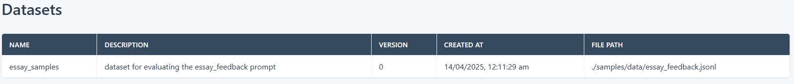
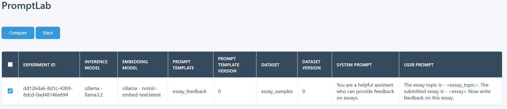
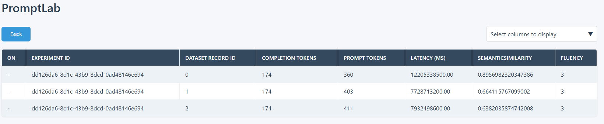

# Quickstart

This sample ([target_evaluation.py](target_evaluation.py)) demonstrates how to use PromptLab to evaluate a simple agent or app or endpoint. 

## Installation and Setup

It's highly recommended to use a virtual environment (try venv or conda or uv).

```bash
pip install promptlab
```

## Initialize PromptLab 

The first step to use PromptLab is to initialize the PromptLab object. Please check [Tracer](../../docs/README.md#tracer) to learn more about the tracer configuration.

```python
tracer_config = {"type": "sqlite", "db_file": "./promptlab.db"}
pl = PromptLab(tracer_config)
```

Once the PromptLab object is ready, you can start the PromptLab Studio to check the assets and experiments.

```python
pl.studio.start(8000)
```

## Create Dataset

A dataset is a JSONL file used to design the experiment. Please check [Dataset](../../docs/README.md#dataset) to learn more about it.

```python
dataset_name = "essay_samples"
dataset_description = "dataset for evaluating the essay_feedback prompt"
dataset_file_path = "./samples/data/essay_feedback.jsonl"
dataset = Dataset(name=dataset_name, description=dataset_description, file_path=dataset_file_path)
ds = pl.asset.create(dataset)
```



## Create Experiment

An experiment evaluates the outcome of a prompt or agent against a set of metrics for a given dataset. Developers can modify hyperparameters (such as prompt template and models) and compare experiment results to determine the best prompt or agent to deploy in production. Please check [Experiment](../../docs/README.md#experiment) to learn more about it.

In the [agent_evaluation.py](agent_evaluation.py), we are using the dataset created in the previous steps to design an experiment. It also uses an evaluation metrics: `exact_match`. Please check [Metric](../../docs/README.md#metric) to learn more about evaluation metrics. Few key points -

- Use the `agent_proxy` attribute to pass a function or callable class which is a wrapper to the agent or endpoint.
- The `completion_model`, `embedding_model` are optional. The models may be necessary if they are required by any metric used in the experiment. If they are not used by any metric, skip them.
- Attribute `prompt_template` is also not necessary, as we are evaluating an agent or app, not a prompt.

```python
experiment_config = {
    "name": "demo_target_evaluation",
    "agent_proxy": agent_proxy,
    "dataset": ds,
    "evaluation": [
        {
            "metric": "exact_match",
            "column_mapping": {
                "response": "$completion",
                "reference": "feedback",
            },
        },
    ],
}
pl.experiment.run(experiment_config)
```



Details of the experiment:

