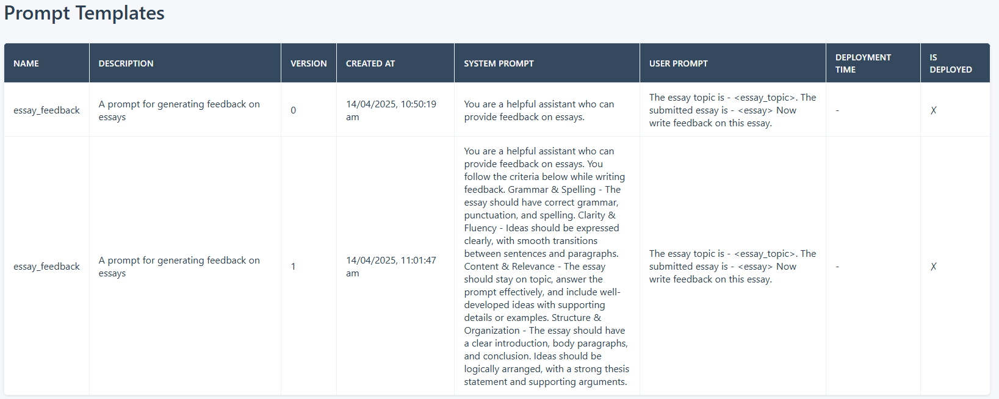

# Asset Versioning

This sample ([versioning.py](versioning.py)) demonstrates how to version prompts using PromptLab. 

## Install python package

It's highly recommended to use a virtual environment (using venv or conda or uv).

    pip install promptlab

## Create a prompt template

Unique identifier of a prompt template is it's name and version. When we create a prompt, it's version is 0. The following code snippet will create the prompt template with version 0.

    prompt_name = "essay_feedback"
    prompt_description = "A prompt for generating feedback on essays"
    system_prompt = "You are a helpful assistant who can provide feedback on essays."
    user_prompt = """The essay topic is - <essay_topic>.
                The submitted essay is - <essay>
                Now write feedback on this essay."""
    prompt_template = PromptTemplate(name=prompt_name, description=prompt_description, system_prompt=system_prompt, user_prompt=user_prompt)
    pt = pl.asset.create(prompt_template)

The following snippet will update the prompt -

    system_prompt="""You are a helpful assistant who can provide feedback on essays. You follow the criteria below while writing feedback.                    
        Grammar & Spelling - The essay should have correct grammar, punctuation, and spelling.
        Clarity & Fluency - Ideas should be expressed clearly, with smooth transitions between sentences and paragraphs.
        Content & Relevance - The essay should stay on topic, answer the prompt effectively, and include well-developed ideas with supporting details or examples.
        Structure & Organization - The essay should have a clear introduction, body paragraphs, and conclusion. Ideas should be logically arranged, with a strong thesis statement and supporting arguments.
        """
    user_prompt="""The essay topic is - <essay_topic>.
        The submitted essay is - <essay>
        Now write feedback on this essay.
        """
    prompt_template = PromptTemplate(name=prompt_name, description=prompt_description, system_prompt=system_prompt, user_prompt=user_prompt)
    pt = pl.asset.update(prompt_template)

