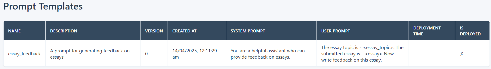

# Quickstart

This sample ([quickstart.py](quickstart.py)) demonstrates how to use PromptLab to evaluate a basic prompt to provide feedback to essays submitted by students. 

## Install python package

Install the python package using pip. It's highly recommended to use a virtual environment. 

    pip install promptlab

## Initialize PromptLab 

The frist step to use PromptLab, is to initialize the PromptLab object. Please check [Tracer](../../docs/README.md#tracer) to learn more about the tracer config.

    tracer_config = {"type": "sqlite", "db_file": "./promptlab.db"}
    pl = PromptLab(tracer_config)

Once the PromptLab object is ready, you can start the PromptLab Studio to check the assets and experiments.

    pl.studio.start(8000)

## Create a prompt template

A prompt template is a prompt with or without placeholders. Please check [Prompt Template](../../docs/README.md#prompt-template) to learn more about it.

A  prompt template has two main attributes - `system_prompt` and `user_prompt`. The sample prompt used in this example is -

    prompt_name = "essay_feedback"
    prompt_description = "A prompt for generating feedback on essays"
    system_prompt = "You are a helpful assistant who can provide feedback on essays."
    user_prompt = """The essay topic is - <essay_topic>.
                The submitted essay is - <essay>
                Now write feedback on this essay."""
    prompt_template = PromptTemplate(name = prompt_name, description = prompt_description, system_prompt = system_prompt, user_prompt = user_prompt)
    pt = pl.asset.create(prompt_template)

Here, `<essay_topic>` and `<essay>` are placeholders that will be replaced with real data before sending to the LLM. PromptLab will search the dataset for columns with these exact names and use their values to replace the corresponding placeholders. Ensure that the dataset contains columns named `essay_topic` and `essay` to avoid errors.

## Create dataset

A dataset is a jsonl file to design the experiment. Please check [Dataset](../../docs/README.md#dataset) to learn more about it.

    dataset_name = "essay_samples"
    dataset_description = "dataset for evaluating the essay_feedback prompt"
    dataset_file_path = "./samples/data/essay_feedback.jsonl"
    dataset = Dataset(name = dataset_name, description = dataset_description, file_path = dataset_file_path)
    ds = pl.asset.create(dataset)

## Create experiment

An experiment evaluates the outcome of a prompt against a set of metrics for a given dataset. Developers can modify hyperparameters (such as prompt template and models) and compare experiment results to determine the best prompt to deploy in production. Please check [Experiment](../../docs/README.md#experiment) to learn more about it.

In the [quickstart.py](quickstart.py), we are using the prompt template and dataset created in the previous steps to design an experiment. It is also using two evaluation metrics `semantic_similarity` and `fluency`. Please check [Metric](../../docs/README.md#metric) to learn more about evaluation metrics.

    experiment_config = {
        "inference_model": inference_model,
        "embedding_model": embedding_model,
        "prompt_template": pt,
        "dataset": ds,
        "evaluation": [
            {
                "metric": "semantic_similarity",
                "column_mapping": {"response": "$inference", "reference": "feedback"},
            },
            {
                "metric": "fluency",
                "column_mapping": {"response": "$inference"},
            },
        ],
    }
    pl.experiment.run(experiment_config)

Details of the experiment.

